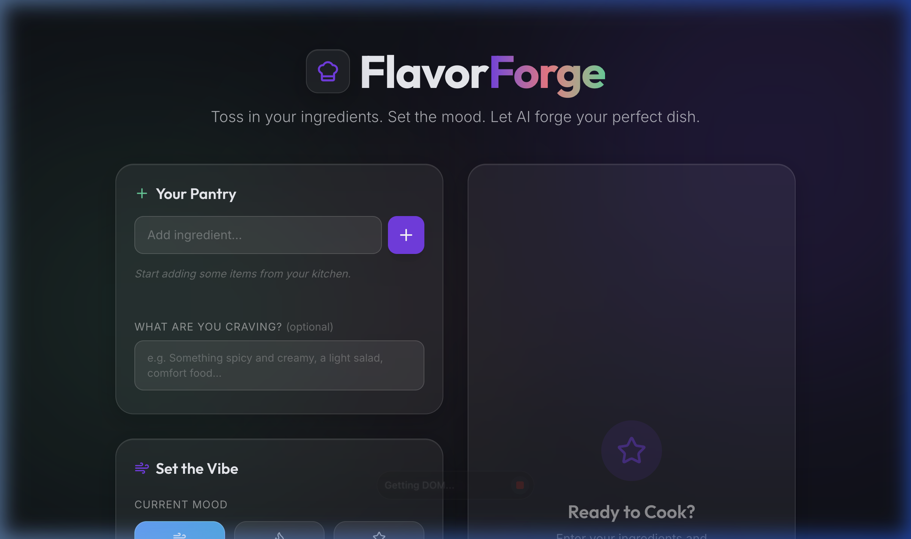

# 🔥 FlavorForge — AI Recipe & Vibe Generator

> Toss in your ingredients. Set the mood. Let AI forge your perfect dish.

FlavorForge is a premium, full-stack AI-powered recipe generator built with a **microservices architecture**. It takes your available ingredients, current mood, and cuisine preference — then orchestrates **Google Gemini AI** to generate a personalized recipe along with curated music recommendations to set the perfect cooking vibe.




---

## ✨ Features

- 🧑‍🍳 **AI Recipe Generation** — Get full recipes with ingredients, step-by-step instructions, cooking time & difficulty.
- 🎵 **Music Recommendations** — Curated English/Hindi song suggestions based on your mood & dish (strictly no Kakkar songs! 🚫).
- 💬 **Mood-Based Quotes** — Uplifting, witty quotes to match your cooking vibe.
- 🍽️ **Food Description** — Optionally describe what you're craving for more tailored results.
- 🌍 **8 Cuisine Types** — Indian, Italian, Mexican, Japanese, Mediterranean, French, American, Thai.
- 🎭 **5 Mood Presets** — Relaxed, Energized, Productive, Adventurous, Cozy.
- 📖 **Step-by-Step Mode** — Navigate recipe instructions one step at a time with an interactive stepper.
- 🎨 **Premium Glass UI** — Modern dark theme with glassmorphism, gradients, and fluid Framer Motion animations.

---

## 🏗️ Architecture

FlavorForge uses an **API Gateway** pattern to orchestrate multiple microservices, ensuring scalability and separation of concerns.

```
┌─────────────────────────────────────────────────────┐
│                    Frontend (React)                  │
│              Vite + Tailwind CSS v4 + Framer Motion  │
│                    Port: 5173                        │
└───────────────────────┬─────────────────────────────┘
                        │
                        ▼
┌───────────────────────────────────────────────────────┐
│                  API Gateway (Express)                │
│               Orchestrates microservices              │
│                    Port: 5005                         │
└──────────┬────────────────────────────┬──────────────┘
           │                            │
           ▼                            ▼
┌─────────────────────┐   ┌──────────────────────────┐
│   Recipe Service     │   │     Mood/Music Service    │
│   Gemini AI → Recipe │   │   Gemini AI → Vibe/Songs  │
│   Port: 5001         │   │   Port: 5002              │
└─────────────────────┘   ┌──────────────────────────┘
```

---

## 🚀 Getting Started

### Prerequisites

- **Node.js** 18+ and **npm**
- **Google Gemini API Key** — [Get one here](https://aistudio.google.com/apikey)

### Installation

```bash
# 1. Clone the repo
git clone https://github.com/ManojK1405/FlavorForge.git
cd FlavorForge

# 2. Install root dependencies (concurrently)
npm install

# 3. Install service dependencies(Just run npm run dev)
cd backend/gateway && npm install && cd ../..
cd backend/services/recipe && npm install && cd ../../..
cd backend/services/mood && npm install && cd ../../..
cd frontend && npm install && cd ..

# 4. Set up environment variables
cp .env.example .env
# Edit .env and add your GEMINI_API_KEY
```

### Running Locally

```bash
# Start all services + frontend concurrently
npm run dev
```

This starts:
| Service | URL |
|---------|-----|
| **Frontend** | http://localhost:5173 |
| **API Gateway** | http://localhost:5005 |
| **Recipe Service** | http://localhost:5001 |
| **Mood Service** | http://localhost:5002 |

---

## 📁 Project Structure

```
FlavorForge/
├── frontend/                  # React + Vite + Tailwind v4
│   ├── src/
│   │   ├── App.tsx            # Premium UI Implementation
│   │   └── index.css          # Design system & glass effects
│   └── index.html
├── backend/
│   ├── gateway/               # API Gateway (Express)
│   │   └── src/index.ts       # Service Orchestration
│   └── services/
│       ├── recipe/            # Recipe Generation Service
│       │   └── src/index.ts   # Gemini AI Logic
│       └── mood/              # Mood/Music Service
│           └── src/index.ts   # Vibe & Song Selection Logic
├── assets/                    # Project screenshots & media
├── .env.example               # Environment variable template
├── package.json               # Root scripts (concurrently)
└── README.md
```

---

## 🛠️ Tech Stack

| Layer | Technology |
|-------|-----------|
| **Frontend** | React 19, TypeScript, Vite, Tailwind CSS v4, Framer Motion |
| **Backend** | Node.js, Express 5, TypeScript |
| **AI** | Google Gemini 2.5 Flash |
| **Architecture** | Microservices with API Gateway pattern |
| **Dev Tools** | Concurrently, tsx (Watch mode), Lucide React |

---

## 📝 API Endpoints

### `POST /api/orchestrate` (Gateway)

Orchestrates recipe + mood generation by calling internal services.

**Request Body:**
```json
{
  "ingredients": ["paneer", "onion", "tomato", "cream"],
  "mood": "Cozy",
  "cuisine": "Indian",
  "foodDescription": "Something spicy and creamy"
}
```

**Response:**
```json
{
  "recipe": {
    "dishName": "Paneer Butter Masala",
    "description": "A rich, creamy tomato-based curry...",
    "ingredients": ["200g paneer", "2 onions", "..."],
    "instructions": ["Step 1...", "Step 2..."],
    "cookingTime": "35 mins",
    "difficulty": "Medium"
  },
  "vibe": {
    "quote": "Let the aroma be your meditation...",
    "musicGenre": "Bollywood Lo-fi Beats",
    "playlistRecommendation": "Chill Hindi acoustic playlist",
    "trackRecommendations": ["Tum Hi Ho by Arijit Singh", "..."],
    "vibeCheck": "Stir slowly and enjoy the process."
  }
}
```

---

## 📄 License

This project is open source and available under the [MIT License](LICENSE).

---

<p align="center">
  <strong>Forged with ❤️ by Manoj K. ✨</strong>
</p>
